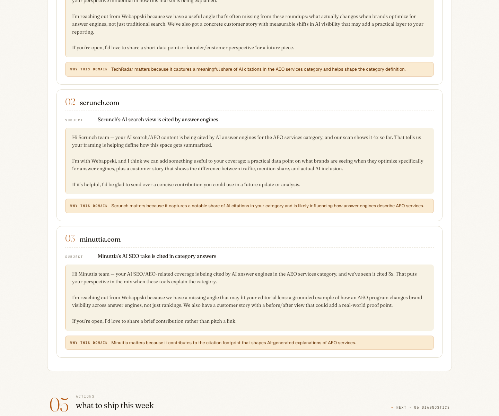
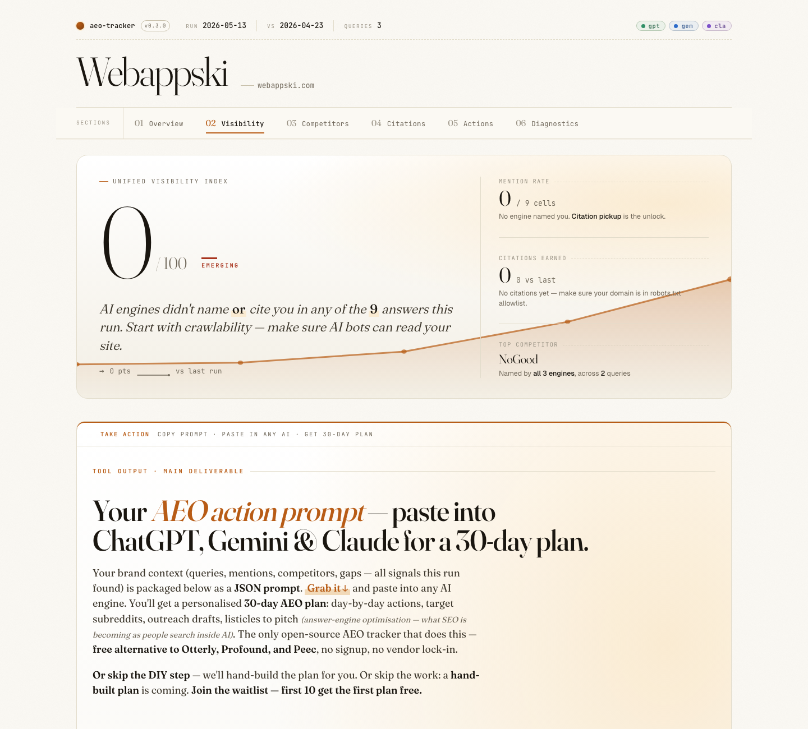
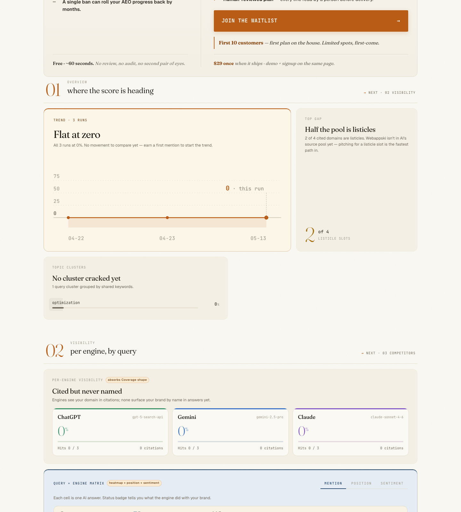
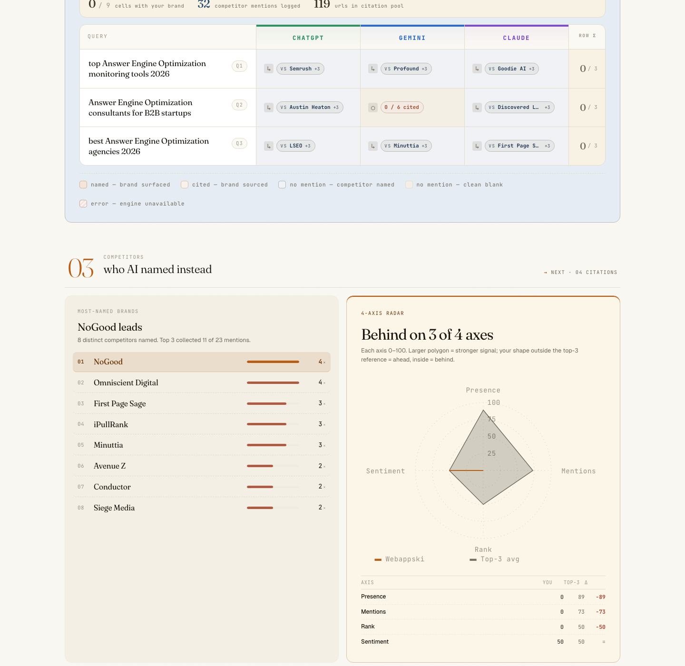

# @webappski/aeo-tracker

[](https://www.npmjs.com/package/@webappski/aeo-tracker)
[](./LICENSE)
[](https://nodejs.org)
[](https://github.com/DVdmitry/aeo-tracker)

**The free, open-source AEO (Answer Engine Optimization) tracker that measures how often AI answer engines name your brand — and generates the LLM-powered action plan to move the needle. An alternative to Profound, Otterly, and Peec.ai that hits official AI APIs instead of web-scraping.**

## TL;DR

**`@webappski/aeo-tracker` checks whether ChatGPT, Gemini, Claude, and Perplexity mention your brand — runs locally, reads your keys from shell env, generates a markdown + HTML report.**

```bash
npm install -g @webappski/aeo-tracker
export OPENAI_API_KEY="sk-proj-..."          # required
export GEMINI_API_KEY="AIzaSy..."             # required
aeo-tracker init --yes --brand=YOURBRAND --domain=YOURDOMAIN.COM --auto \
  && aeo-tracker run \
  && aeo-tracker report --html
```

**Cost:** ~$0.20 per run at the 2-key minimum. **Get keys (2 min):** [OpenAI](https://platform.openai.com/api-keys) · [Google AI Studio](https://aistudio.google.com/apikey). **Optional engine columns:** [Claude](https://console.anthropic.com/settings/keys) (+~$0.30), [Perplexity](https://docs.perplexity.ai/) (+~$0.05).

> **Never opened a terminal before?** Jump to [Path B — first time in a terminal](#path-b--first-time-in-a-terminal-510-minutes) for a 5-minute walkthrough. **Want the full context first?** See [Key facts](#key-facts) and [What you see in the report](#what-you-see-in-the-report) below.

---

`@webappski/aeo-tracker` is a Node.js CLI that measures how often AI answer engines mention your brand, tracks your position in ranked AI answers, extracts competitor mentions, saves verbatim AI quotes for audit, and produces a prioritised, engine-specific action plan (e.g. *"email editors of firstpagesage.com to get added to their AEO agency list — cited 2× by AI this run"*).

**Minimum setup needs 2 API keys: OpenAI + Gemini (~$0.20/run).** That covers the ChatGPT and Gemini columns of the report. Add `ANTHROPIC_API_KEY` to unlock the Claude column (~$0.50/run total) or `PERPLEXITY_API_KEY` for the Perplexity column (~$0.55/run). OpenAI + Gemini are required because they also power the two-model extractor described below — Anthropic and Perplexity are strictly optional engine expansions.

**As of April 2026, `@webappski/aeo-tracker` is the only open-source AEO tracker that calls ChatGPT, Gemini, Claude, and Perplexity via official APIs** — no web scraping, no proxied browser sessions, no third-party scoring layer between you and the raw AI output.

It also uses a **two-model LLM cross-check on competitor extraction** (`gpt-5.4-mini` + `gemini-2.5-flash` — the two cheap classification models, not the engine-measurement models): every brand name extracted from an AI response is independently verified against the source text by both models. If only one model found it, the name lands in the "unverified" tier of the report (dashed badge); if both agreed, it's "verified" (solid badge). Hallucinated brand mentions are filtered out automatically — a defense subscription competitors don't offer.

Zero runtime dependencies, MIT license, ~$0.20/run (2-engine minimum) to ~$0.55/run (full 4-engine coverage) using your own API keys. Works with Node.js 18+ on macOS, Linux, and Windows.

### Key facts

- **Pricing:** Free (MIT license) + API spend — **~$0.20/run** (2-engine minimum) to **~$0.55/run** (full 4-engine coverage)
- **Required API keys:** **OpenAI + Gemini** (both needed — they power the two-model competitor extractor and serve as the ChatGPT + Gemini columns in the report)
- **Optional API keys:** Anthropic (adds Claude column, ~$0.30/run), Perplexity (adds Perplexity column, ~$0.05/run)
- **Supported AI engines measured:** ChatGPT (OpenAI), Gemini (Google), Claude (Anthropic), Perplexity — plus manual paste mode for Perplexity Pro, Bing Copilot, ChatGPT Pro UI
- **Outputs:** Markdown report with inline SVG charts + full HTML report with interactive drill-down
- **Architecture:** Direct provider APIs (no web scraping, no third-party dashboard, no vendor lock-in)
- **Extraction:** Two-model LLM cross-check (GPT + Gemini) with hallucination filter
- **Validation:** Pre-flight query checks — ambiguous acronym detection + LLM industry-fit + commercial-intent filter
- **Resilience:** `init --auto` retries across providers on billing/auth/rate-limit errors; **auto-recovers from validator blocks** by swapping in validated alternatives with intent-diversity ranking; actionable error panels on every failure path (top-up links, regenerate-key hints, `--keywords` escape hatch) — no raw Node stack traces unless `AEO_DEBUG=1`
- **Runtime:** Node.js ≥18, zero runtime dependencies
- **License:** MIT open source, source code on GitHub

### How your API keys are used

Two roles, often confused. This table makes the split explicit:

| Role | What it does | Models used | API keys needed |
|---|---|---|---|
| **Engines being measured** (report columns) | The AI systems your buyers actually query. Each engine gets its own column in the report showing whether it mentioned your brand. | `gpt-5-search-api`, `gemini-2.5-pro`, `claude-sonnet-4-6`, `sonar-pro` | OpenAI + Gemini **required** (ChatGPT + Gemini columns). Anthropic **optional** (Claude column). Perplexity **optional** (Perplexity column). |
| **Competitor extractor cross-check** (every run) | Runs after each engine response: two cheap LLMs independently extract brand names from the response text and cross-verify against the source. Mismatches land in the "unverified" tier with a dashed badge. | `gpt-5.4-mini` + `gemini-2.5-flash` (the CLASSIFY-tier models from OpenAI + Google — not the engine-measurement models) | Uses the **same** OpenAI + Gemini keys as above — no extra keys needed. |

**Why OpenAI + Gemini are required, Anthropic + Perplexity optional:** because your OpenAI and Gemini keys pull double duty (engine + extractor), losing either one breaks the extractor's cross-check. Anthropic and Perplexity only add engine columns — skipping them doesn't compromise the report's reliability.

> **`init --auto` is resilient to provider outages.** If your priority-#1 research provider returns a billing, auth, or rate-limit error (402/401/429), init automatically retries with the next provider in the priority order (`OpenAI → Gemini → Anthropic`). Only if every configured provider fails do you see an abort — and in that case init prints an actionable panel listing every attempt, a top-up link per failing provider, and a `--keywords` escape hatch that skips the brainstorm entirely. Real bugs (TypeError, malformed requests, generic 5xx) are NOT retried — they surface immediately so the root cause isn't masked.

> Built by [Webappski](https://webappski.com), an Answer Engine Optimization agency that runs aeo-tracker weekly on its own brand. We open-sourced aeo-tracker after measuring 28–44/100 on HubSpot's AEO Grader while direct API tests showed zero mentions of Webappski — third-party AEO scores are not reality.



> The "Recommended actions" section from a real `aeo-tracker run` on Webappski's own brand. Every card is LLM-generated from your actual run data — specific engines, specific URLs, specific competitors to displace. Zero external assets, renders on GitHub and Notion.

## Quickstart

Two paths — pick the one that matches your comfort level. Both end with the same working install.

### Path A — you're comfortable with a terminal (~60 seconds)

```bash
npm install -g @webappski/aeo-tracker

# Export your 2 required keys. Replace the placeholders with real values
# from https://platform.openai.com/api-keys and https://aistudio.google.com/apikey.
export OPENAI_API_KEY="sk-proj-..."          # starts with "sk-proj-" or "sk-"
export GEMINI_API_KEY="AIzaSy..."             # starts with "AIzaSy"

# Optional — add these later to unlock more engine columns in the report:
# export ANTHROPIC_API_KEY="sk-ant-api03-..."   # starts with "sk-ant-"
# export PERPLEXITY_API_KEY="pplx-..."           # starts with "pplx-"

# Run everything in one chain
aeo-tracker init --yes --brand=YOURBRAND --domain=YOURDOMAIN.COM --auto \
  && aeo-tracker run \
  && aeo-tracker report --html
```

### Path B — first time in a terminal (~5–10 minutes)

If you've never run a CLI tool before, that's fine — aeo-tracker needs one-time setup, but weekly `run` takes zero terminal skill after that. Founder-friendly walk-through:

**1. Open Terminal.** On macOS: <kbd>⌘</kbd>+<kbd>Space</kbd> → type `Terminal` → Enter. On Windows 10/11: Start menu → type `PowerShell` → Enter. On Linux: you know where it is.

**2. Install Node.js (once per machine).** Check if you have it: paste `node --version` and press Enter. If it prints `v18.x.x` or higher, skip to step 3. If you get "command not found", download and run the installer from [nodejs.org](https://nodejs.org) (LTS version). Re-open Terminal after install.

**3. Install aeo-tracker.** Paste and Enter:
```bash
npm install -g @webappski/aeo-tracker
```
If you see a permission error about `EACCES`, the fix is [on the npm docs](https://docs.npmjs.com/resolving-eacces-permissions-errors-when-installing-packages-globally). Typically: `sudo npm install -g @webappski/aeo-tracker` on macOS/Linux.

**4. Get your 2 required API keys.** Open these two links in new tabs, sign up (free), and click "Create new key" on each. Copy the full key string each gives you (looks like `sk-proj-...` for OpenAI, `AIzaSy...` for Google).

- OpenAI — https://platform.openai.com/api-keys
- Google Gemini — https://aistudio.google.com/apikey

**5. Save the keys to your shell profile.** Paste these lines into Terminal **one at a time**, replacing `PASTE_KEY_HERE` with the actual strings from step 4:

```bash
echo 'export OPENAI_API_KEY="PASTE_OPENAI_KEY_HERE"' >> ~/.zshrc
echo 'export GEMINI_API_KEY="PASTE_GEMINI_KEY_HERE"' >> ~/.zshrc

# Optional — skip if you don't have these keys. Add them later if you want
# the Claude and Perplexity columns in your report:
# echo 'export ANTHROPIC_API_KEY="PASTE_ANTHROPIC_KEY_HERE"' >> ~/.zshrc
# echo 'export PERPLEXITY_API_KEY="PASTE_PERPLEXITY_KEY_HERE"' >> ~/.zshrc

source ~/.zshrc
```

> **Windows/PowerShell users:** use `[System.Environment]::SetEnvironmentVariable('OPENAI_API_KEY','...','User')` instead, then restart PowerShell.
>
> **If your shell is `bash` (rare on modern macOS):** replace `~/.zshrc` with `~/.bashrc` in the lines above.

**6. Run aeo-tracker.** Replace `YOURBRAND` and `YOURDOMAIN.COM` with your actual brand name and domain:

```bash
aeo-tracker init --yes --brand=YOURBRAND --domain=YOURDOMAIN.COM --auto
aeo-tracker run
aeo-tracker report --html
```

The HTML report auto-opens in your browser. From week 2 onward, just `aeo-tracker run && aeo-tracker report --html` once a week — that's your entire ongoing workflow.

### What if my keys are already in `.zshrc` under different names?

Common on dev machines — you already use ChatGPT/Claude via some other tool and the keys live in `~/.zshrc` (or `~/.bashrc`, `~/.profile`) under custom names. `aeo-tracker init` tries to find them in three stages before giving up:

**Stage 1 — standard names.** If you have any of these in shell env, they're used directly:
```
OPENAI_API_KEY   GEMINI_API_KEY   ANTHROPIC_API_KEY   PERPLEXITY_API_KEY
```

**Stage 2 — heuristic fallback.** If standard names are missing, `aeo-tracker` scans every env var in your shell against these regex patterns (name must **start** with a provider keyword AND contain `API`, `KEY`, `TOKEN`):

```
OpenAI:     ^(OPENAI | GPT)         + any chars + (API | KEY | TOKEN)
Gemini:     ^(GEMINI | GOOGLE_AI)   + any chars + (API | KEY | TOKEN)
Anthropic:  ^(CLAUDE | ANTHROPIC)   + any chars + (API | KEY | TOKEN)
Perplexity: ^(PERPLEXITY | PPLX)    + any chars + (API | KEY | TOKEN)
```

Matches found this way are **proposed for confirmation** during `init`:
```
Heuristic match — these look like API keys under non-standard names:
  ? OpenAI (ChatGPT): OPENAI_API_KEY_DEV
  ? Google (Gemini):  GEMINI_KEY_PROD
Accept these? [Y/n]
```

Whatever you confirm is written into `.aeo-tracker.json` under `providers[].env`, so every later `run` knows where to look. **Your actual key values stay in `process.env`** — never written to disk.

**Stage 3 — interactive per-provider prompt.** For EVERY provider still missing after stages 1+2, `init` asks you directly: *"OpenAI (ChatGPT) env var name (required):"*. Required providers (OpenAI + Gemini) retry up to 3 times on bad input. Optional providers (Anthropic + Perplexity) accept Enter to skip. You type just the **name** of the env var (e.g. `MY_OPENAI_KEY`), never the key itself — your actual key stays in `process.env`.

> **Security:** If you accidentally paste an API key value instead of an env var name, `init` detects it via provider-specific prefixes (`sk-proj-`, `AIzaSy`, `sk-ant-`, `pplx-`) and rejects the input with a clear message — *"that looks like an API key value, not an env var name"*. Your actual key value is never logged, never displayed, never written to disk. Only the env var **name** lands in `.aeo-tracker.json::providers[].env`.

> **Important:** Stage 3 also runs when stages 1+2 found SOME providers but not all — e.g. if you have `OPENAI_API_KEY` (auto-detected) but Gemini sits under `MY_GEMINI_VAR` (not heuristic-matched), init still prompts you for Gemini. You can't end up half-configured.

### Which names match, which don't

| Name in your `~/.zshrc` | Stage | Why |
|---|---|---|
| `OPENAI_API_KEY` | 1 ✓ | exact standard name |
| `OPENAI_API_KEY_DEV` | 2 ✓ | starts with `OPENAI`, contains `KEY` |
| `GPT_TOKEN` | 2 ✓ | `GPT` alias |
| `CLAUDE_KEY` | 2 ✓ | `CLAUDE` alias |
| `GOOGLE_AI_TOKEN` | 2 ✓ | `GOOGLE_AI` alias |
| `PPLX_API_KEY` | 2 ✓ | `PPLX` alias |
| `MY_OPENAI_KEY` | 3 (manual) ✗ | regex anchored — name must **start** with `OPENAI` |
| `DEV_CLAUDE_TOKEN` | 3 (manual) ✗ | same — prefix blocks match |
| `SECRET_AI_KEY` | 3 (manual) ✗ | no provider keyword |

### If your name doesn't auto-match — three fixes

**Option A (simplest, recommended): create a standard-name alias in `~/.zshrc`.**
Keep your original var; add a line that points the standard name at it. Works for any tool that expects standard names, not just aeo-tracker:

```bash
# Add next to your existing line in ~/.zshrc
export OPENAI_API_KEY="$MY_OPENAI_KEY"
# Then reload the shell
source ~/.zshrc
```

Result: both `OPENAI_API_KEY` and `MY_OPENAI_KEY` resolve to the same key. Stage 1 finds it instantly.

**Option B: use the Stage 3 interactive prompt.**
Run `aeo-tracker init` (without `--yes`, so it's interactive). When it asks *"No API keys auto-detected. Do you have API keys under custom env var names? [y/N]"*, answer `y`. It walks through each provider and lets you type the exact var name (e.g. `MY_OPENAI_KEY`). Your answer is saved to `.aeo-tracker.json::providers.openai.env` and reused on every subsequent `run`.

**Option C: edit `.aeo-tracker.json` by hand.**
If you prefer fully explicit config (or you're setting up in a CI environment where interactive prompts don't fit), create `.aeo-tracker.json` manually with the `env` fields pointing at your custom names:
```json
{
  "providers": {
    "openai":    { "model": "gpt-5-search-api", "env": "MY_OPENAI_KEY" },
    "gemini":    { "model": "gemini-2.5-pro",    "env": "MY_GEMINI_VAR" },
    "anthropic": { "model": "claude-sonnet-4-6", "env": "CLAUDE_SECRET" }
  }
}
```
Then `aeo-tracker run` reads those vars from `process.env` on each invocation — no re-detection needed.

### CI-mode caveat

In CI (`aeo-tracker init --yes`), Stage 3 (interactive prompt) is disabled — CI can't answer prompts. If neither Stage 1 nor Stage 2 finds your keys, `init --yes` hard-fails with an explicit error. **For CI always use Option A (standard-name alias) or Option C (explicit `env` in pre-committed `.aeo-tracker.json`).**

### Get your keys

| Provider | Link | Notes |
|---|---|---|
| OpenAI (required) | [platform.openai.com/api-keys](https://platform.openai.com/api-keys) | Create a "project" key — scoped to this project only. Starts with `sk-proj-`. |
| Google Gemini (required) | [aistudio.google.com/apikey](https://aistudio.google.com/apikey) | Starts with `AIzaSy`. Free tier covers weekly cadence for one brand. |
| Anthropic Claude (optional) | [console.anthropic.com/settings/keys](https://console.anthropic.com/settings/keys) | Adds Claude column (~$0.30/run). Starts with `sk-ant-`. |
| Perplexity (optional) | [docs.perplexity.ai](https://docs.perplexity.ai/) | Adds Perplexity column (~$0.05/run). Starts with `pplx-`. |

First run costs ~$0.20 at the 2-key minimum.

## Your first run will show 0% — that's normal

New brands typically score **0–5% in the first 4 weeks**. AEO visibility compounds slowly: AI models don't learn about new brands in real time. They update when third-party sources (blog posts, directories, review sites) start mentioning you. `aeo-tracker` is designed to track that compounding — the value is in week-over-week deltas, not the absolute score on day 1. The `Recommended actions` section of every report tells you exactly which third-party sources to pitch to move the needle.

See [What changes over time](#what-changes-over-time) for a realistic month-by-month trajectory.

---

## Who this is for

- **B2B SaaS founders** — observability, devtools, data platforms, analytics — measuring whether ChatGPT, Gemini, or Claude mentions their product when buyers ask category questions
- **AEO agencies** tracking client brands week-over-week with auditable raw data
- **Marketing teams** comparing brand presence across AI answer engines side-by-side
- **Developers** who want CI-grade visibility monitoring (rich exit codes, JSON output, zero deps)

## Common use cases

### Launching a SaaS product — is ChatGPT mentioning me?

Run `aeo-tracker init` right after launch to lock in a baseline of three commercial queries your target customers would actually type into an AI answer engine. Run `aeo-tracker run` weekly and compare deltas. Typical trajectory: 0% mentions in weeks 1–4, first mention somewhere between week 6 and week 12, depending on how much third-party content references your brand.

### Running a weekly AEO audit for agency clients

Create one `.aeo-tracker.json` per client, run the CLI in a cron script, collect the generated HTML reports into a shared folder. Each report is a single self-contained file — no dashboard dependency, no shared login. Raw AI responses land in `aeo-responses/YYYY-MM-DD/` for audit when a client asks "what exactly did ChatGPT say about me?"

### Auditing AI visibility before a funding round

Founders pitch "we show up in ChatGPT when buyers ask X" and need evidence. Run aeo-tracker against the exact buyer-intent queries, hand the due-diligence team the `aeo-responses/` folder with verbatim JSON — every claim is verifiable from the raw response payload.

### Competitive intelligence: who does AI recommend in my category?

Even if your brand is invisible, the competitors AI surfaces are a weekly signal of who is winning the AI-answer share. The Position section of the report aggregates competitor mentions across queries and engines; the Recommended actions section tells you which third-party sources (blog posts, LinkedIn articles, directories) to pitch for inclusion.

### CI-integrated regression alerts

Add `aeo-tracker run` to a GitHub Actions cron workflow. Exit code `1` fires when score drops more than the configured threshold (default 10 points). Exit code `2` fires on a "completely invisible" run. Hook these to your Slack alerts channel.

## What you see in the report

Every `aeo-tracker run` produces a self-contained HTML report — one file, inline SVG, no external assets. Here's what it looks like on real data.

### 1. Visibility at a glance — score, trend, per-engine breakdown



Traffic-light hero (`INVISIBLE` / `EMERGING` / `PRESENT` / `STRONG`), score delta vs the previous run, and per-engine hit-rate cards with their own sparklines. The heatmap below is the compact status grid — you see all 9 cells (3 queries × 3 engines) in one look.

### 2. Position in AI answers — who AI names instead of you



For every query × engine pair: whether you made the ranked list, plus the competitors AI named in your place. **Solid badges** = both extraction models agreed the name is a real competitor. **Dashed badges with `?`** = only one model agreed (weaker signal, surfaced honestly instead of silently dropped). Click any cell — or keyboard-Tab to it and press Enter — to see the full raw AI response.

### 3. Who AI mentioned instead of you — and which pages AI cites



Aggregate leaderboard of competitors across all tracked queries, and the pages AI engines keep linking to. Your domain is highlighted in amber so you can see at a glance whether AI is citing your content (even when it doesn't name you).

### 4. Session cost — transparent, per-model


Every run shows what you actually paid to which model. Multiply by your weekly cadence to project monthly spend. No hidden subscription, no inflated "credits" — just dollars.

### 5. Recommended actions — LLM-generated, engine-aware, concrete


An LLM reads the run data + your category and produces prioritised action cards — not generic "improve SEO" advice. Real examples from our own run: *"Email editors of firstpagesage.com, minuttia.com, and the LinkedIn article '10 best AEO agencies 2026' (industry publications where competitors are listed) — these pages were cited 2× each by AI engines, getting added is the fastest path to appearing in ChatGPT/Gemini/Claude answers."* Priority + intent kind (gap / compete / defend / win) + target engines per card.

---

## What is AEO (Answer Engine Optimization)?

AEO is the practice of measuring and improving how often AI answer engines (ChatGPT, Gemini, Claude, Perplexity) mention your brand when users ask category questions. Unlike traditional SEO, which optimizes for click-through from search result pages, AEO optimizes for **inclusion in the AI-generated answer itself** — because that's what users see and act on.

The foundational metric is trivially simple: *"When a user asks an AI engine about my category, does my brand appear in the answer?"* Everything else (position, sentiment, citation source) is secondary to that yes/no. `aeo-tracker` measures the yes/no directly, then enriches it with position, citations, and competitors.

---

## Table of contents

- [Common use cases](#common-use-cases) — SaaS launch, agency audits, CI alerts
- [What you see in the report](#what-you-see-in-the-report) — 5 screenshots from a real run
- [60-second init](#60-second-init) — your first run, real transcript
- [What changes over time](#what-changes-over-time) — weeks 1, 8, and onward
- [Sample report](./examples/sample-report.md) — real markdown output with inline SVG
- [Installation](#installation)
- [Migrating from 0.1.x to 0.2.x](#migrating-from-01x-to-02x) — breaking changes + upgrade steps
- [Commands](#commands) — full CLI reference
- [Exit codes](#exit-codes) — graduated CI alerting
- [Configuration](#configuration)
- [Environment variables](#environment-variables) — `AEO_DEBUG`, `NO_COLOR`
- [Manual paste mode](#manual-paste-mode) — for Perplexity, Copilot, ChatGPT Pro UI
- [CI integration](#ci-integration) — GitHub Actions, bash cron
- [Compared to alternatives](#compared-to-alternatives) — Profound, Otterly, Peec.ai, HubSpot, Ahrefs
- [FAQ](#faq)
- [Limitations](#limitations) — what this tool does NOT do
- [Roadmap](#roadmap)
- [Behind this tool](#behind-this-tool) — who built it and why

---

## 60-second init

`aeo-tracker init` sets up a working config from your brand name and your domain. It detects your API keys, fetches **your own site** to learn your category, asks an LLM to suggest 3 commercial test queries, and validates them before saving.

Example transcript — running `aeo-tracker init --yes --brand=YOURBRAND --domain=YOURDOMAIN.COM --auto`. Everywhere you see `YOURDOMAIN.COM` below is a placeholder for **your own site** — the tool fetches it because that's the brand being initialized. `aeo-tracker` never sends your data to webappski.com or any third-party server:

```text
@webappski/aeo-tracker — init

Checking environment for API keys...
  ✓ OPENAI_API_KEY
  ✓ GEMINI_API_KEY
  ✓ ANTHROPIC_API_KEY (optional — adds Claude column)

Configured providers: OpenAI (ChatGPT), Google (Gemini), Anthropic (Claude)

Auto-suggest will:
  1. Fetch https://YOURDOMAIN.COM (your own site) to learn your category
  2. Extract title, meta, headings, first 2KB of body text
  3. Send that excerpt to Anthropic (Claude) via YOUR API key
  4. Show you the 3 suggested queries before saving
  Your API key never leaves this machine. No telemetry. Nothing is sent to webappski.com.

  Fetching https://YOURDOMAIN.COM... (~165KB)
  Asking Anthropic (Claude)... (~$0.0024)

Suggested queries (language: en, commercial-only)
  Q1: best YOURCATEGORY services 2026
  Q2: top YOURCATEGORY monitoring tools 2026
  Q3: YOURCATEGORY consultants for B2B startups

  ✓ Static check — no ambiguous acronyms
  ✓ LLM industry-fit check — all 3 queries pass (confidence ≥ 0.9)
  ✓ Commercial-only policy — all retrieval-triggered (no methodology / how-to queries)

✓ Created .aeo-tracker.json
  Brand: YOURBRAND | Domain: YOURDOMAIN.COM
  Queries: 3, Providers: 3

Next: aeo-tracker run
```

What you paid for the setup: **1 LLM call, $0.0024**. What you got: a ready-to-run config with 3 queries pre-validated for commercial intent and industry fit — a baseline you can trust for week-over-week tracking.

Full transcript: [`examples/sample-init-transcript.txt`](./examples/sample-init-transcript.txt).

---

## What changes over time

The value of `aeo-tracker` compounds with history. From our own weekly audits, **week 4 is when sparkline trends become meaningful** — one-snapshot data is a baseline, not a signal.

| Day | Command | What you see | What's written to disk |
|---|---|---|---|
| 0 | `aeo-tracker init` | Auto-suggest from your site, ~$0.0024 | `.aeo-tracker.json` |
| 1 | `aeo-tracker run` | Baseline score (often 0% for young brands), exit code 2 | `aeo-responses/YYYY-MM-DD/` (9 raw JSON + `_summary.json`) |
| 1 | `aeo-tracker report` | Markdown + HTML with heatmap, verbatim quotes when mentions exist, competitor barchart | `aeo-reports/YYYY-MM-DD/report.md` |
| +7 | `aeo-tracker run` | Second snapshot, 1 week later | `aeo-responses/YYYY-MM-DD/` |
| +7 | `aeo-tracker diff --last 2` | Delta table: gained/lost mentions, competitor movement, exit code 0/1 | stdout |
| +7 | `aeo-tracker report` | Same format, now with sparkline trend per query | `aeo-reports/YYYY-MM-DD/report.md` |
| +28 | `aeo-tracker run --json \| jq .score` | CI-ready JSON, no ANSI noise | stdout |

By week 2, `diff` is meaningful. By week 4, sparklines tell a real story. By month 3, canonical-source trends identify *which pages* AI engines keep citing for your vertical (SEO gold — concrete pages to pitch for mentions).

---

## Sample report

Every `aeo-tracker report` produces a self-contained markdown file with inline SVG charts. See [`examples/sample-report.md`](./examples/sample-report.md) for a real one — generated from Webappski's own weekly audit, score 0/9 (yes, that's the founder's own brand; visibility work is in progress).

We use this exact format internally for client audits. The fact that you can run it locally for free is intentional — proprietary scoring is the problem we're solving, not the moat we're building.

A fragment of the inline SVG heatmap shows three engines × three queries, colour-coded — zero external dependencies, renders on GitHub, Notion, VSCode preview, and any markdown viewer that supports inline SVG:

```html
<svg xmlns="http://www.w3.org/2000/svg" viewBox="0 0 428 144" width="100%">
  <text x="220" y="20" text-anchor="middle" font-weight="600" fill="#475569">Q1</text>
  <text x="300" y="20" text-anchor="middle" font-weight="600" fill="#475569">Q2</text>
  <text x="380" y="20" text-anchor="middle" font-weight="600" fill="#475569">Q3</text>
  <text x="168" y="50" text-anchor="end" fill="#0f172a">ChatGPT</text>
  <rect x="184" y="32" width="72" height="28" rx="6" fill="#ef4444"/>
  <text x="220" y="50" text-anchor="middle" font-weight="700" fill="#fff">NO</text>
  <!-- ... 8 more cells ... -->
</svg>
```

Neutral tailwind palette (`#10b981` green / `#ef4444` red / `#94a3b8` gray), fixed — never brand colours.

---

## Installation

### Prerequisites

- **Node.js 18+** on macOS, Linux, or Windows
- **Two API keys minimum:** `OPENAI_API_KEY` + `GEMINI_API_KEY`. Both are used as AI engines being measured AND as the two-model competitor extractor — `aeo-tracker run` hard-fails if either is missing. Get them in 2 minutes: [OpenAI](https://platform.openai.com/api-keys), [Google AI Studio](https://aistudio.google.com/apikey).
- **Optional keys:** `ANTHROPIC_API_KEY` (adds Claude column), `PERPLEXITY_API_KEY` (adds Perplexity column)

### Install

```bash
npm install -g @webappski/aeo-tracker
```

Global install is recommended; local `npm install` also works if you prefer to vendor it. Zero runtime dependencies — pure Node, no `node_modules` bloat.

Verify:

```bash
aeo-tracker --version        # prints current version
aeo-tracker --help
```

### Migrating from 0.1.x to 0.2.x

> **Upgrading from 0.2.0 / 0.2.1 / 0.2.2 / 0.2.3 / 0.2.4 to 0.2.5?** No action needed — patches only. 0.2.1 was internal code quality; 0.2.3 (formerly 0.2.2) added init resilience + actionable error panels; 0.2.4 added validator auto-recovery; 0.2.5 adds a live TTY spinner and post-run "Next" hint (see [Roadmap](#roadmap)). Same config, same env vars, same exit codes.

If you're upgrading from a previously-installed `@webappski/aeo-tracker@0.1.x`, 0.2.0 introduces two breaking changes. Neither will silently corrupt your data — each hard-fails with a clear message — but both require a one-time action.

**1. Set both `OPENAI_API_KEY` and `GEMINI_API_KEY`.** 0.1.x worked with any single provider. 0.2.0 uses OpenAI + Gemini jointly as the two-model competitor extractor, so both are required on every `run`. If you only had one of them before, get the second key in ~2 minutes: [OpenAI keys](https://platform.openai.com/api-keys), [Google AI Studio](https://aistudio.google.com/apikey). Anthropic and Perplexity remain optional.

**2. Regenerate your queries once.** 0.1.x `init` might have written methodological queries ("how to get recommended by AI"), which 0.2.0's commercial-only validator now rejects — those queries produce tutorial answers without vendor lists, not useful for weekly visibility tracking. Regenerate with the new validator in one command:

```bash
aeo-tracker init --queries-only
```

This keeps your brand, domain, and provider config; only the 3 queries are refreshed and revalidated. Cost: ~$0.01. Old `competitors: [...]` field and outdated model names in the config are auto-migrated (silently ignored / auto-upgraded respectively).

**Escape hatch:** if for research reasons you want to keep a non-commercial query temporarily, `aeo-tracker run --force` bypasses the validator gate for one run. Not recommended for normal weekly tracking.

### First run (minimum 2 keys)

```bash
# Export your two required keys (or add to ~/.zshrc — see Quickstart Path B).
# Key prefixes: OpenAI "sk-proj-" / Gemini "AIzaSy" / Anthropic "sk-ant-" / Perplexity "pplx-".
export OPENAI_API_KEY="sk-proj-..."
export GEMINI_API_KEY="AIzaSy..."

# Optional — skip if absent. Each adds one engine column to the report:
# export ANTHROPIC_API_KEY="sk-ant-api03-..."
# export PERPLEXITY_API_KEY="pplx-..."

# Setup — creates .aeo-tracker.json with 3 validated commercial queries
aeo-tracker init --yes --brand="YourBrand" --domain="yourbrand.com" --auto

# Measure — runs queries, extracts competitors, writes today's snapshot
aeo-tracker run

# Generate the HTML report and open in your browser
aeo-tracker report --html
```

The entire first-run flow takes ~60 seconds and costs ~$0.20 in API calls at 2-key minimum setup.

---

## Commands

| Command | What it does |
|---|---|
| `aeo-tracker init` | Create `.aeo-tracker.json` — brand, domain, 3 queries, competitors, provider config |
| `aeo-tracker run` | Query each configured provider with each query; save raw responses + summary |
| `aeo-tracker run-manual <provider> --from-dir <dir>` | Import pasted answers for engines without API access; merge into today's summary |
| `aeo-tracker diff [dateA] [dateB]` | Compare two runs; show delta table + competitor movement |
| `aeo-tracker report` | Generate markdown with inline SVG charts + verbatim AI quotes |
| `aeo-tracker --version` / `--help` | Self-explanatory |

### Flags reference

| Flag | Command(s) | Purpose |
|---|---|---|
| `--yes` / `-y` | `init` | Non-interactive mode (CI/dotfiles). Requires `--brand`, `--domain`, and `--auto` or `--manual` |
| `--brand <name>` | `init --yes` | Brand name (skip prompt) |
| `--domain <url>` | `init --yes` | Site URL or domain (skip prompt) |
| `--category <text>` | `init --yes` | Category description — disambiguates ambiguous industry terms. If omitted, auto-inferred from site meta |
| `--auto` | `init --yes` | Full research pipeline: brainstorm → filter → score → cross-model validate → select |
| `--manual` | `init --yes` | Skip LLM analysis (non-interactive manual requires pre-existing queries) |
| `--light` | `init --yes --auto` | Bypass research pipeline; use single-shot suggest (faster/cheaper, less thorough) |
| `--keywords "q1,q2,q3"` | `init --yes` | Bring-your-own keywords; skip LLM brainstorm entirely. **$0 LLM cost** |
| `--json` | `run` | Structured JSON to stdout (ANSI suppressed); pipe-friendly for CI |
| `--from-dir <path>` | `run-manual` | Directory containing `q1.txt`, `q2.txt`, `q3.txt` with pasted answers |
| `--last <N>` | `diff` | Compare the last N runs (default 2) |
| `--since <date>` | `diff` | Compare given date to latest run |
| `--output <path>` | `report` | Override default `aeo-reports/<date>/report.md` path |

---

## Exit codes

`run`, `diff`, and `run-manual` encode outcome state in exit codes so CI can react correctly instead of treating every non-zero as a generic failure.

| Code | Meaning | Typical CI response |
|---|---|---|
| `0` | Score stable or improved vs previous run | success — nothing to alert |
| `1` | Score dropped more than `regressionThreshold` (default `10`pp) | high-priority alert — visibility regressing |
| `2` | All checks returned zero mentions | medium alert — brand invisible everywhere (normal on day 1) |
| `3` | All providers errored | infrastructure alert — keys/billing/network issue |

When `run` exits `3`, it prints the **"all engines failed" panel** — per-engine reason grouped by provider, affected query count, the env var each key was read from, and option-numbered fixes (top-up link per failing billing, key-regeneration hint per auth failure, wait-and-retry for rate-limits, infra-check for network errors, and a final *"remove the failing engine from `.aeo-tracker.json`"* escape hatch). Skipped in `--json` mode so programmatic consumers still parse clean JSON.

Tune the threshold in `.aeo-tracker.json`:

```json
{ "regressionThreshold": 5 }
```

---

## Configuration

`.aeo-tracker.json` after `init`:

```json
{
  "brand": "YOURBRAND",
  "domain": "YOURDOMAIN.COM",
  "category": "YOURCATEGORY — one-line description of your competitive space",
  "queries": [
    "best YOURCATEGORY services 2026",
    "top YOURCATEGORY monitoring tools 2026",
    "YOURCATEGORY consultants for B2B startups"
  ],
  "validationCache": [
    {
      "query": "best YOURCATEGORY services 2026",
      "valid": true,
      "confidence": 0.95,
      "search_behavior": "retrieval-triggered",
      "validatedAt": "2026-04-23T10:00:00Z"
    }
  ],
  "regressionThreshold": 10,
  "providers": {
    "openai":     { "model": "gpt-5-search-api",  "env": "OPENAI_API_KEY" },
    "gemini":     { "model": "gemini-2.5-pro",     "env": "GEMINI_API_KEY" },
    "anthropic":  { "model": "claude-sonnet-4-6",  "env": "ANTHROPIC_API_KEY" },
    "perplexity": { "model": "sonar-pro",          "env": "PERPLEXITY_API_KEY" }
  }
}
```

### Fields

- **`brand`, `domain`** — required. Used for mention detection and the `brand-on-site` sanity check during auto-suggest.
- **`category`** — required. Describes your competitive category; feeds into the two-model extractor prompt so it knows "Reddit / G2 / Trustpilot" are data sources, not competitors in the AEO services category. Auto-inferred from site meta if `init` isn't given `--category`.
- **`queries`** — exactly 3. Unbranded. All three must pass the commercial-intent validator — methodological "how to X" queries are blocked by default (they produce tutorial-style AI answers without vendor lists, polluting the trend signal).
- **`validationCache`** — written by `init` / `init --queries-only`. Stores the LLM validator verdict per query so `run` doesn't re-validate unchanged queries. Drop it to force fresh validation.
- **`regressionThreshold`** — optional. Default `10` percentage points. `run` exit code `1` fires when score drops by more than this vs the previous run.
- **`providers[].env`** — optional override. By default `OPENAI_API_KEY` etc.; if your keys live under non-standard names (e.g. `OPENAI_API_KEY_DEV`), `init` detects them via regex and writes the actual names here. The model name is auto-discovered at run start (newest available for each provider).

### API keys

| Variable | Provider | Required? | Get a key |
|---|---|---|---|
| `OPENAI_API_KEY` | OpenAI (ChatGPT) | **Required** | [platform.openai.com/api-keys](https://platform.openai.com/api-keys) |
| `GEMINI_API_KEY` | Google (Gemini) | **Required** | [aistudio.google.com/apikey](https://aistudio.google.com/apikey) |
| `ANTHROPIC_API_KEY` | Anthropic (Claude) | Optional | [console.anthropic.com/settings/keys](https://console.anthropic.com/settings/keys) |
| `PERPLEXITY_API_KEY` | Perplexity (Sonar) | Optional | [docs.perplexity.ai](https://docs.perplexity.ai/) |

**Why OpenAI + Gemini are required:** every `aeo-tracker run` uses them twice — (1) as two of the AI engines being measured for brand mentions, and (2) as the two-model cross-check extractor that identifies competitor names in every AI response. Without both, the extractor hard-fails before any API call is made (preserves your budget). Anthropic and Perplexity only add their respective engine columns to the report and are fully optional.

### Cost per run

**`aeo-tracker run`** (weekly visibility audit — the main workflow):

| Role | Provider / Model | ≈ cost per run (3 queries) |
|---|---|---|
| Engine (required) | OpenAI `gpt-5-search-api` | ~$0.13 |
| Engine (required) | Google `gemini-2.5-pro` | ~$0.03 |
| Engine (optional) | Anthropic `claude-sonnet-4-6` | ~$0.30 |
| Engine (optional) | Perplexity `sonar-pro` | ~$0.05 |
| Competitor extractor (required, auto) | `gpt-5.4-mini` + `gemini-2.5-flash` | ~$0.02 |
| Query validator (first run only, cached after) | cheapest available provider | ~$0.002 |
| Report recommendations (on `report`) | one provider with key set | ~$0.01 |

**Total per `run`:**
- **Minimum setup** (OpenAI + Gemini only): **~$0.20 per run** (~$0.80/month at weekly cadence)
- **Recommended** (+ Anthropic for Claude column): **~$0.50 per run** (~$2.00/month)
- **Full coverage** (+ Perplexity): **~$0.55 per run** (~$2.40/month)

Subscription AEO tools typically run $29–$299+/month. Model names reflect the latest available as of April 2026; `aeo-tracker` auto-discovers the newest model on each provider at run start.

**`aeo-tracker init`** (one-time setup per brand):

| Mode | One-time cost | When to use |
|---|---|---|
| `--auto` (default, research pipeline) | ~$0.005 | New brand, first setup — brainstorm + cross-model validate |
| `--auto --light` | ~$0.003 | Trust the LLM, speed over thoroughness |
| `--keywords "q1,q2,q3"` (BYO) | **$0** | You already have your queries (migration, manual research) |
| `--manual` | $0 | Type queries in the interactive prompt |
| Single-provider full pipeline | ~$0.003 | Only one LLM API key configured — validator skipped, warning issued |

### Environment variables

API keys (`OPENAI_API_KEY`, `GEMINI_API_KEY`, `ANTHROPIC_API_KEY`, `PERPLEXITY_API_KEY`) are covered under [API keys](#api-keys). The following operational flags modify output behaviour:

| Variable | Effect |
|---|---|
| `AEO_DEBUG=1` | On unexpected errors (anything classified as `other`), print the raw Node stack trace to stderr in addition to the actionable panel. Default off — production users see only the panel |
| `NO_COLOR=1` | Disable ANSI color codes in all output (panels, tables, progress bars). Useful for CI logs, dumb terminals, and piping to files |

---

## Manual paste mode

Some engines don't have a usable API at your tier — Perplexity Pro-only, Microsoft Copilot no consumer API, ChatGPT Pro UI, Claude.ai. `run-manual` reads pasted answers from text files and runs the same detection pipeline (mentions, competitors, URL extraction, canonical sources).

```bash
mkdir perplexity-responses
# paste Perplexity's answer for Q1 into perplexity-responses/q1.txt
# ... same for q2.txt, q3.txt

aeo-tracker run-manual perplexity --from-dir ./perplexity-responses
```

Results merge into today's `_summary.json` alongside API runs. Each manual result is tagged `"source": "manual-paste"`; `diff` and `report` treat manual and API results identically.

---

## CI integration

### Bash (cron)

```bash
#!/bin/bash
aeo-tracker run --json > /var/log/aeo-$(date +%F).json
case $? in
  0) : ;;  # stable
  1) slack-alert "AEO regression detected" ;;
  2) : ;;  # still invisible — expected early
  3) slack-alert "aeo-tracker: API errors" ;;
esac
```

### GitHub Actions

```yaml
name: Weekly AEO Audit
on:
  schedule: [{ cron: '0 9 * * 1' }]  # Monday 9:00 UTC

jobs:
  audit:
    runs-on: ubuntu-latest
    steps:
      - uses: actions/checkout@v4
      - uses: actions/setup-node@v4
        with: { node-version: 20 }
      - run: npm install -g @webappski/aeo-tracker
      - run: aeo-tracker run --json > latest.json
        env:
          OPENAI_API_KEY:    ${{ secrets.OPENAI_API_KEY }}
          GEMINI_API_KEY:    ${{ secrets.GEMINI_API_KEY }}
          ANTHROPIC_API_KEY: ${{ secrets.ANTHROPIC_API_KEY }}
          NO_COLOR:          '1'   # strip ANSI codes from logs (auto-detected on non-TTY, explicit here for clarity)
      - uses: actions/upload-artifact@v4
        with: { name: aeo-latest, path: aeo-responses/ }
```

`NO_COLOR=1` in the environment disables ANSI output (auto-detected when stdout isn't a TTY; the override is there for the rare case of piping to a colour-aware tool).

---

## How `init --auto` quality was measured

We benchmarked `init --auto` against manually-written "ideal" queries for 5 real brands (TypelessForm, Webappski, Linear, Notion, Stripe). For each brand we pre-wrote 3 ideal queries (one per intent bucket), then ran the pipeline and scored each of the 15 generated queries semantically (intent + topic + specificity).

| Metric | Result |
|---|---|
| **Strict semantic matches** (tight alignment) | **11/15 (73%)** |
| **Lenient semantic matches** (partial or sub-intent drift) | 14/15 (93%) |
| Internal pass threshold | ≥7/15 (47%) |
| Mean cost per init | $0.0050 |
| Cost variance (max ÷ min) | 1.10× |
| Hallucinated competitor-brand rate | ~12% |

The **strict 11/15 number is the honest one to cite**. Lenient is shown for transparency but should not be used in isolation — we explicitly criticise third-party AEO graders for that inflated-scoring pattern ([see "Compared to alternatives" below](#compared-to-alternatives)), and we hold ourselves to the same bar.

Scoring rubric and per-brand breakdown: [`docs/benchmark-ideals.md`](https://github.com/DVdmitry/aeo-tracker/blob/main/docs/benchmark-ideals.md), [`docs/benchmark-results.md`](https://github.com/DVdmitry/aeo-tracker/blob/main/docs/benchmark-results.md) (links open on GitHub — `docs/` is not shipped in the npm tarball).

Caveats that limit generality:
- 5-brand sample — not a statistical population.
- Author wrote the ideals and scored the matches, with a documented self-review at the end of the results doc to surface bias.
- Validator and brainstorm both use LLMs whose behaviour can shift between model revisions.
- Benchmark excludes Perplexity as a brainstorm/validator (API costs) and Gemini as a validator (only tested Anthropic primary + OpenAI validator).

If you run the benchmark yourself with different brands or provider pairs, PRs updating `docs/benchmark-results.md` are welcome.

---

## Compared to alternatives

`aeo-tracker` is designed as an **open-source alternative** to hosted AEO monitoring platforms. We tested every tool in this table on Webappski's own brand before building aeo-tracker — the gap between third-party scores and direct API truth is what motivated the project.

### Profound alternative

[Profound](https://tryprofound.com) is a commercial AEO platform with a hosted dashboard, priced for enterprise. `aeo-tracker` is a free, open-source Profound alternative for teams who want:

- Direct API calls (same numbers a user asking ChatGPT would see) instead of Profound's proxy/emulated sessions
- Their raw AI responses saved as JSON (Profound stores aggregates server-side)
- No vendor lock-in — at uninstall you keep the entire `aeo-responses/` folder with every AI response
- Transparent cost accounting per run, not a monthly bundle
- MIT source code — audit or fork the scoring logic

Trade-off: aeo-tracker is a CLI, not a hosted dashboard. No team collaboration, no email alerts, no multi-brand management UI. If your use case is one brand on a weekly cron, this is a feature. If you're managing 50 clients with SSO, Profound is still the fit.

### Otterly alternative

[Otterly.AI](https://otterly.ai) is an AI SEO monitoring subscription. `aeo-tracker` is an open-source Otterly alternative that adds:

- **Two-model extraction cross-check** (GPT + Gemini run in parallel; intersection = strong signal, disagreement = weaker signal shown with dashed badge)
- **Pre-flight query validation** — blocks methodological queries ("how to get recommended by AI") before spending API budget
- **Commercial-intent filter by default** — only retrieval-triggered queries pass, preventing false "0% visibility" scores from tutorial-style AI answers

Otterly covers more engines out of the box (6+ vs our 4); aeo-tracker covers extras via manual paste mode for engines without APIs.

### Peec.ai alternative

[Peec.ai](https://peec.ai) is a subscription AEO tool focused on brand-mention tracking. `aeo-tracker` is a free Peec.ai alternative with:

- Full verbatim AI response saved per run — you can re-analyse historical answers with new extractors without paying again
- Inline-SVG charts in markdown and HTML reports — works in CI logs, GitHub PRs, Notion, email
- Graduated exit codes (0/1/2/3) for CI integration — regression-aware alerting without writing glue code

### HubSpot AEO Grader alternative

[HubSpot's AEO Grader](https://www.hubspot.com/products/marketing/aeo) is a free scoring tool that returns a number 0–100. It's a lead-generation funnel into HubSpot's marketing suite. `aeo-tracker` is a direct-measurement alternative that returns raw API data instead of a proprietary score:

- HubSpot gave Webappski 28–44/100 while `aeo-tracker` (direct API) showed 0 mentions in the same week. Third-party AEO scores often inflate reality.
- aeo-tracker reports the actual AI answer text, so you verify the claim yourself.

### Ahrefs AI Visibility alternative

[Ahrefs AI Visibility](https://ahrefs.com) uses a 320M prompt database with proprietary scoring. `aeo-tracker` is lighter-weight and direct:

- Same-day actionable — run it once, read the HTML report, know what to do
- Your API keys stay on your machine (Ahrefs requires data upload)
- Open source — no black-box scoring

### Side-by-side comparison

| Feature | `@webappski/aeo-tracker` | HubSpot AEO Grader | Ahrefs AI Visibility | Otterly | Profound |
|---|---|---|---|---|---|
| Price | Free + ~$0.20–$0.55/run | Free (lead-gen) | Free (limited) | $29+/mo | Enterprise |
| Method | Direct API calls | Proprietary scoring | 320M prompt DB | Platform scraping | UI testing |
| Engines covered | 4 (+ manual paste) | 3 | Proprietary | 6 | 8 |
| Raw responses saved | Yes (JSON per run) | No | No | No | No |
| Verbatim AI quotes | Yes (markdown + HTML) | No | No | No | No |
| Two-model extraction cross-check | Yes (GPT + Gemini, hallucination-filtered) | No | No | No | No |
| Pre-flight query validation | Yes (acronym + industry-fit + commercial-only) | No | No | No | No |
| Recommended actions (LLM-generated, engine-aware) | Yes | No | No | No | Generic |
| Inline SVG charts (HTML + MD) | Yes (zero deps) | N/A | N/A | N/A (dashboard) | N/A (dashboard) |
| Honest about 0% | Yes | Often inflates (tested) | False negatives observed | Unknown | Unknown |
| Open source | MIT | No | No | No | No |
| Self-hosted / no data shared | Yes — your keys | Data → HubSpot | Data → Ahrefs | Data → Otterly | Data → Profound |
| CI/CD exit codes | Yes (0/1/2/3) | No | No | No | No |
| Canonical source tracking | Yes | No | No | No | No |

The pattern we found: hosted dashboards are incentivized to produce a number. A score of 30/100 is more engaging than a truthful 0/9 — and dashboards that consistently return 0 don't retain users. `aeo-tracker` has the opposite bias: it shows zero when it's zero, so the baseline is trustworthy.

---

## FAQ

### What API keys do I need to run aeo-tracker?

**Two keys are mandatory: `OPENAI_API_KEY` and `GEMINI_API_KEY`.** They play two roles on every run: (1) ChatGPT and Gemini columns in the visibility report, and (2) the two-model cross-check extractor that identifies competitor brand names in every AI response. Without both, `aeo-tracker run` hard-fails before spending any API credits — this is intentional, to avoid silent degradation.

Two more keys are optional: `ANTHROPIC_API_KEY` adds the Claude column (recommended for full 3-engine coverage), `PERPLEXITY_API_KEY` adds the Perplexity column. Total cost at weekly cadence: ~$0.80/month (2-key minimum) to ~$2/month (full 3-engine).

Get the required keys in 2 minutes: [platform.openai.com/api-keys](https://platform.openai.com/api-keys) and [aistudio.google.com/apikey](https://aistudio.google.com/apikey).

### How do I check if ChatGPT mentions my brand?

Run `aeo-tracker init` to set up three unbranded queries relevant to your category, then `aeo-tracker run`. The output shows per-query/per-engine whether ChatGPT (via OpenAI API) mentions your brand in the answer text (`yes`), only in cited sources (`src`), or not at all (`no`). Raw JSON responses are saved to `aeo-responses/<date>/` so you can inspect exactly what ChatGPT said.

### How do I track my brand's AI visibility over time?

`aeo-tracker run` weekly. Each run saves a dated snapshot. Use `aeo-tracker diff --last 2` to see what changed between the two most recent runs, or `aeo-tracker report` to generate a markdown document with trend sparklines that populate after week 2.

### Can I see what AI engines say about my company?

Yes — `aeo-tracker report` extracts **verbatim quotes** from AI responses that mention your brand, into a "What AI Engines Actually Said" section of the generated markdown. When brand appears only in cited URLs (not text), a separate citation-only block records that too.

### What's a free alternative to Profound / Otterly / Peec AI?

`aeo-tracker` is free and open-source (MIT). You pay only for LLM API calls — about $0.20 per weekly run with 2-engine minimum (OpenAI + Gemini) or $0.50 with full 3-engine coverage including Claude — using your own keys. It tracks direct-API mentions (ChatGPT, Gemini, Claude, Perplexity) without a proprietary scoring layer, and gives you raw responses so you can verify every claim.

### How is this different from HubSpot AEO Grader or Ahrefs AI Visibility?

Third-party dashboards apply proprietary scoring that frequently doesn't match what AI engines actually return. In week 1 of our public challenge, HubSpot gave us 28–44/100 while direct API tests showed zero mentions. `aeo-tracker` skips the scoring layer entirely — it asks the AI engines directly and reports their answers verbatim.

### Why does `aeo-tracker report` produce both markdown and HTML?

Markdown with inline SVG renders everywhere: GitHub, Notion, VSCode preview, email clients with MD support, any CI log viewer — perfect for automated pipelines and PR comments. HTML is for humans reading the report in a browser: interactive drill-down on any query × engine cell (click to see the full raw AI response), richer typography, and all the chart variants in one scrollable page. Both files are self-contained — no external CDN fetch, no JavaScript dependencies, no tracking pixels. Pass `--html` / `--no-html` to toggle either.

### What if my API keys are named differently?

`aeo-tracker init` runs a three-stage detection: (1) standard names (`OPENAI_API_KEY` etc.), (2) regex heuristic that catches `OPENAI_API_KEY_DEV`, `CLAUDE_KEY`, `GOOGLE_AI_TOKEN` and similar, (3) direct prompt asking you to name your variables. Whatever names you confirm are written into `.aeo-tracker.json` so the tool uses them on every subsequent run.

### Does auto-suggest use web search?

No. We explicitly disable web-search tools on every LLM auto-suggest call. The model only sees the site excerpt we scraped and your brand/domain. This prevents contamination where the model might fetch outdated or incorrect information from Google and contradict what's actually on your page. Result: suggestions reflect *your site*, not general market knowledge.

### Is my data safe?

Yes. No data leaves your machine except to the AI providers you configure (same providers you'd query from a browser). No telemetry. No analytics. No traffic to `webappski.com`. Raw responses stay on your disk. Our User-Agent string identifies the tool when fetching your own site (`aeo-tracker/0.2.2 (+https://webappski.com)`).

### I run a site in Polish / German / French. Does it work?

Yes. The auto-suggest prompt tells the LLM to match the site's primary language (detected from `<html lang>`). Tested on English, Polish, and German sites. Suggestions come back in the site's language.

### How do I monitor Gemini mentions of my brand?

`aeo-tracker` calls the Google Gemini API directly (`gemini-2.5-pro` as of April 2026) on every run. Your brand's mentions in Gemini answers appear in the `Gemini` column of the report, with the full verbatim Gemini response saved to `aeo-responses/<date>/q*-gemini-*.json`. Both API-level mentions and citation-URL mentions are tracked.

### Does aeo-tracker work with Claude Sonnet 4.6?

Yes. The Claude column in the report uses the latest Claude Sonnet model via the Anthropic API (auto-discovered at run start, defaults to `claude-sonnet-4-6`). Override the model in `.aeo-tracker.json` under `providers.anthropic.model` if you prefer `claude-haiku-4-5` or an earlier version.

### Can I track Perplexity citations?

Yes, two ways. Via the Perplexity API if you have `PERPLEXITY_API_KEY` set — responses are included in every `run`. For the Perplexity Pro browser UI (different from the API), save the UI's answer to `q1.txt` / `q2.txt` / `q3.txt` in any directory and run `aeo-tracker run-manual perplexity --from-dir <your-dir>` — the same mention/citation/competitor extraction runs on your pasted text and merges into today's summary.

### What's the difference between SEO and AEO (Answer Engine Optimization)?

SEO optimizes for ranking in the blue-link search-result page. AEO optimizes for inclusion in the AI-generated answer itself. A user who asks ChatGPT "best AEO tools 2026" never sees a link list — they see an AI paragraph that either mentions you or doesn't. Classic SEO tools measure click-through from SERPs; aeo-tracker measures inclusion-in-answer directly.

### What's the best AEO tool for B2B SaaS startups?

For B2B SaaS teams running weekly visibility audits, `aeo-tracker` is designed around that specific use case: CI-friendly exit codes, auditable raw responses, zero vendor lock-in, and a commercial-only query validator that blocks methodological queries (which produce tutorial answers without vendor lists).

**When to choose something else (honest):** if you need a hosted dashboard with team SSO, Slack/email alerts, and multi-brand management UI, **Profound** or **Peec.ai** are the better fit — they solve collaboration and alerting that `aeo-tracker` deliberately doesn't. If you need wider engine coverage out-of-the-box (6+ engines without manual paste mode), **Otterly** is ahead. `aeo-tracker` is the right pick for indie founders, small AEO agencies with ≤10 clients, and dev-centric teams who prefer CLI + CI integration. See the [alternatives comparison](#compared-to-alternatives) for full side-by-side.

### How accurate is AI visibility tracking?

As of April 2026, aeo-tracker's accuracy comes from three decisions: (1) direct API calls (not web-scraping — the scraped version is noisier due to personalization and session state), (2) two-model cross-check on competitor extraction (names survive only if both GPT and Gemini agree they're competitors in your category), (3) hallucination filter that grep-verifies every extracted name against the source AI response. Remaining probabilistic variance: ~5–10% week-over-week fluctuation on the same queries due to stochastic AI output. Use weekly cadence to smooth noise.

### How often should I run aeo-tracker?

Weekly is the sweet spot for most use cases. Daily adds noise without signal (AI models don't update fast enough). Monthly loses meaningful trend resolution. For launch campaigns or PR pushes, run before and after the event to measure impact.

### How much does AEO monitoring cost per month?

At the default weekly cadence (4 runs/month), AEO monitoring with aeo-tracker costs **~$0.80/month** with 2-engine minimum setup, **~$2.00/month** with 3-engine coverage (adding Claude), or **~$2.40/month** with full 4-engine coverage (adding Perplexity). Subscription AEO tools typically run $29–$299+/month. The trade-off: subscriptions include hosted dashboards, team collab, and alerts; aeo-tracker is a CLI that you orchestrate yourself.

### Can I use aeo-tracker to track multiple brands?

Yes — create a separate working directory for each brand with its own `.aeo-tracker.json`. For agency workflows, a wrapper script that loops over client directories is ~10 lines of bash. Historical data stays isolated per brand.

### What AEO metrics should I track?

The three that correlate with revenue in our experience: (1) **mention rate** — % of queries where AI names you, (2) **position-in-list** — when mentioned, are you #1 or #8?, (3) **citation-source coverage** — are any of your own pages among the URLs AI cites, even when they don't name you? aeo-tracker reports all three per run. Engagement metrics from traditional SEO (CTR, rankings) don't apply to AEO.

### Does aeo-tracker work with ChatGPT Plus or Pro browser?

Not directly via API — the ChatGPT Plus browser UI uses a different stack than the OpenAI API. For the API (`gpt-5-search-api` as of April 2026), aeo-tracker calls it natively. For the browser UI, use manual paste mode — paste the UI's answer text and aeo-tracker extracts mentions/citations/competitors from it.

### Is aeo-tracker a Profound alternative?

Yes. `@webappski/aeo-tracker` is an open-source Profound alternative with direct API access instead of emulated browser sessions, raw response storage instead of server-side aggregates, and MIT licensing instead of commercial subscription. Trade-off: CLI tool, not hosted dashboard. See [Profound alternative section](#profound-alternative) for the full comparison.

### Is aeo-tracker an Otterly alternative?

Yes, for teams who want open source and direct API access. [Otterly.AI](https://otterly.ai) is a commercial AI SEO monitoring subscription; `aeo-tracker` is a free Node.js CLI that adds two differentiators Otterly doesn't have: (1) a two-model LLM cross-check on competitor extraction (GPT + Gemini must both agree; single-model signals land in a visible "unverified" tier with a dashed badge), and (2) a pre-flight query validator that blocks methodological queries before spending API budget. Otterly covers more engines out of the box (6+ vs our 4 via API); aeo-tracker covers extras via manual paste mode. See the [Otterly alternative section](#otterly-alternative) for the full side-by-side.

### Is aeo-tracker a Peec.ai alternative?

Yes, for users who prefer open source and self-hosted. Peec.ai is a subscription SaaS; aeo-tracker runs on your own machine with your own API keys. Full verbatim AI responses are saved locally so you can re-analyse historical data without re-running paid API calls. See [Peec.ai alternative section](#peecai-alternative).

---

## Limitations

- **API ≠ browser UI.** Personalization, session context, and occasional model upgrades mean API responses can differ slightly from what users see in ChatGPT/Gemini/Claude browsers. In practice we've found that combining `run` with weekly browser checks on Perplexity gives the most complete picture — API captures the systematic baseline, manual browser checks catch personalization-level drift.
- **Week-over-week stochastic variance.** Same queries on the same day typically produce ±5–10% score fluctuation across runs because AI outputs are probabilistic. Use weekly cadence (not daily) to smooth noise — one run is a snapshot, month-over-month trends are the real signal.
- **Provider rate limits on free/low tiers.** `gpt-5-search-api` and `claude-sonnet-4-6` have per-minute token caps on most plans; running 3 queries in parallel is usually fine, but if you run multiple brands back-to-back you may hit 429. Add a `sleep 30` between brand runs as a simple mitigation.
- **Single-brand scope per config.** `.aeo-tracker.json` tracks one brand; multi-brand agency workflows require one directory per client + a wrapper script. Multi-brand profiles are on the roadmap.
- **Gemini citation URLs are Vertex AI redirect tokens.** The tool resolves them to readable domains using the `title` field; if the title isn't domain-like, the citation is dropped rather than shown as an unreadable token.
- **No cross-platform testing on Windows yet.** Node-native code should work, but we only test on macOS and Linux.
- **Interactive multi-match flow untested.** If heuristic detection finds multiple candidate env vars for the same provider, the interactive picker works but hasn't been exercised end-to-end in automated tests. Non-interactive mode takes the first match.

---

## Roadmap

**v0.2.5 (current, 2026-04-23)** — UX polish: live TTY spinner during long pipeline phases (brainstorm/validate/simulate) so users see elapsed seconds instead of a frozen terminal; `Next: aeo-tracker report --html` hint after successful `run` / `run-manual` (mirrors the existing post-`init` convention). Non-TTY and `--json` modes unchanged — CI logs stay flat and grep-able. 10 new tests, 159 total green.

**v0.2.4 (2026-04-23)** — Validator auto-recovery. When `init --auto` validator blocks a query, init now auto-swaps it with a validated alternative from the research pipeline's candidatePool (intent-diversity ranking), instead of discarding the 5 already-validated alternatives and aborting. `--yes` mode: silent swap + warning line disclosing measurement-semantics shift. TTY mode: numbered prompt `[1-4/m/a]`. Only `informationalIssues` blockers are auto-recoverable — static/llm blockers fall through to actionable panel (substitution unsafe for those). 20 new tests, 149 total green.

**v0.2.3 (2026-04-23)** — Republish of 0.2.2 payload (npm version slot conflict). No code differences. Init resilience (retry loop across `OpenAI → Gemini → Anthropic` on 402/401/429), full error-coverage matrix (billing / auth / rate-limit / network / filesystem / config / site-fetch / bot-protection), actionable error panels on every failure path (init abort, all-engines-failed, top-level catch), per-provider interactive key prompt for non-standard env var names. **No breaking changes vs 0.2.0.** 129 tests. DONE.

**v0.2.0 (2026-04)** — Two-model LLM competitor extractor (GPT + Gemini cross-check, hallucination filter), commercial-only query validator, full HTML report with interactive per-cell drill-down, category-aware extraction, validation cache, LLM-generated recommended actions, response-quality tiers. **Breaking changes:** run now requires both OpenAI + Gemini keys; non-commercial queries rejected by default. See [Migrating from 0.1.x](#migrating-from-01x-to-02x).

For the full version history (keyword research pipeline, manual paste mode, `diff`, `--json`, exit codes, auto-suggest) see [CHANGELOG.md](./CHANGELOG.md).

**v0.3.0 (in progress)** — Structured provider error protocol (`AeoProviderError` as public API), `withProviderFallback` abstraction replacing the inline retry loop, consolidated `AeoError` + single-dispatcher exit-code ownership, unified panel renderer, integration tests against frozen provider-response fixtures. Internal refactor, no CLI break. See [`docs/v0.3.0-architecture-migration.md`](./docs/v0.3.0-architecture-migration.md).

**Next (no fixed dates — feedback-driven):**
- Multi-brand profiles for agencies running weekly audits on many clients
- Diagnostic prompts asking AI engines *why* they don't cite you
- Optional SQLite-backed history for longer trends beyond filesystem snapshots
- README AEO-discoverability optimization based on real user query patterns from npm downloads

**Not planned:** hosted dashboard, proprietary scoring layer, data uploads to Webappski servers. Those are the things we deliberately don't build — transparency and local-first privacy are core values.

---

## Case studies

Real-world weekly runs where you can read both the numbers and the founder's interpretation:

- **TypelessForm — 33/100, week 5 of launch** — full breakdown of why ChatGPT and Gemini land 1/3 each, why Claude is 0/3, and which canonical sources the engines cite instead. Includes all five report screenshots. <https://typelessform.com/blog/free-open-source-aeo-tracker>
- **Same write-up cross-posted on dev.to** for developers who want the JS extractor code inline rather than the long-form narrative: <https://dev.to/alexisa/free-open-source-aeo-tracker-our-real-score-was-33100-258i>

If you publish a run on your own brand, open a PR adding it here — case studies are the most useful documentation this README has.

---

## Behind this tool

We built `aeo-tracker` because the existing tools didn't tell us the truth. HubSpot's AEO Grader scored Webappski at 28–44/100 the same week direct API tests showed **zero mentions** across every engine. We needed something honest, so we made it — and we run it on our own brand every Monday morning.

The tool is free and always will be. If you run it on your brand and want to discuss what the numbers mean — or want a second opinion on which interventions actually move the needle — we're [reachable](https://webappski.com). We've spent the last year acting on data exactly like what this tool produces, for our own audits and for clients.

Everything public about our methodology lives in the weekly reports at [webappski.com/blog](https://webappski.com/en/posts/aeo-visibility-challenge-week-1). The tool itself is the "what"; the blog is the "how".

- 🐛 [Report a bug](https://github.com/DVdmitry/aeo-tracker/issues/new?template=bug_report.md)
- 💡 [Request a feature](https://github.com/DVdmitry/aeo-tracker/issues/new?template=feature_request.md)
- 💬 [Ask a question](https://github.com/DVdmitry/aeo-tracker/discussions)
- 🔧 [Open a pull request](https://github.com/DVdmitry/aeo-tracker/pulls)
- ⭐ [Star the repo](https://github.com/DVdmitry/aeo-tracker)

---

## License

MIT — do whatever you want with it.
